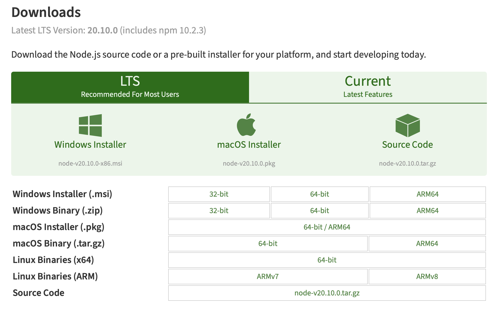
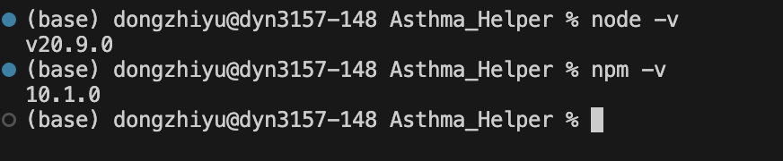
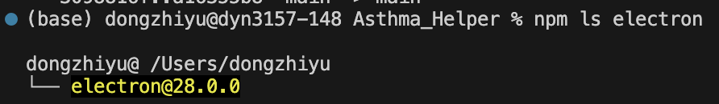
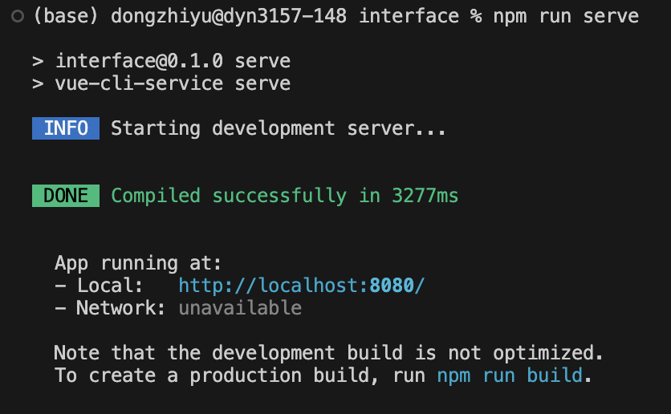

# Asthma_Helper

## Work Allocation
- [X] Zhiyu Dong: Interface Construction between front-end and back-end
- [X] Hongbo Wang: Interface Construction between front-end and back-end
- [X] Chengkai Yao: API data processing and partical user interface construction
- [X] Qian Tong Lim: API data processing
- [X] Xing Lim: User Interface Construction

## Some Learning Materials:
There is a tutorial of vue springboot full-stack development, but in Chinese, I recommend everyone to have a view, it's quite simple:
[Tutorial](https://www.cnblogs.com/GoodHelper/p/8430422.html)

## Environment Setup:

1.**Nodejs Installation**: [A Detail Steps](https://blog.csdn.net/ZHANGYANG_1109/article/details/121229581)

Latest Version(Current): [v21.4.0](https://nodejs.org/en)

Recommended Version(Recommended for most users): [v20.10.0 LTS](https://nodejs.org/en/download)

Project Version (Recommended use for this projecy): [v20.9.0](https://nodejs.org/en/blog/release/v20.9.0)



2. **Check the nodejs version and npm version**:
Since node.js default configuration npm, so do not have to download and configure npm separately, as long as node.js installation is successful, then you can directly use the npm command to download moudle.
The following commends could be use to check the version of npm and nodejs:
```
node -v
npm - v
```


3. **Install Vue-Cli (scaffold)**
```
npm install -g @vue/cli
```

4. **Construct the project**
    - Clone the project to local repo
    ```
    git clone https://github.com/ZhiyuNoel/Asthma_Helper.git
    ```
    After clone the code to local repo, the code cannot directly run as the lack of dependent packages and modules. Thus, download dependencies (node_module) after clone the project:
    ```
    cd Asthma_Helper
    ```
    - Dependency download:[Google Drive](https://drive.google.com/drive/folders/1TW9JJ3D9O6ctM_kChVQl8tpSerUVHDTB?usp=share_link)

5. **Dependency installation (Optional)**: 
    However, if you want to install dependencies by yourself, the installations should satisfied following requirements:

    After 
    - install the axios for call of http requires:
    ```
    sudo npm install --save axios // For macOS or Linux
    npm install --save axios // For windows
    ```

    - Install element plus library (Component lib):
    ```
    sudo npm install --save element-plus
    npm install --save element-plus
    ```

    - Install font-awesome icon library:
    ```
    sudo npm install --save font-awesome
    npm install --save font-awesome
    ```

    - Install sass library:
    ```
    // For MacOS
    sudo npm install --save-dev node-sass
    sudo npm install --save-dev sass-loader

    // For Windows
    npm install --save-dev node-sass
    npm install --save-dev sass-loader
    ```

    - Install mock.js
    ```
    sudo npm install --save-dev mockjs
    sudo npm install --save-dev axios-mock-adapter

    npm install --save-dev mockjs
    npm install --save-dev axios-mock-adapter
    ```

6. **Electron building (Optional)**:
The electron is used to convert the vue project from a web-based to client-based
The electron could be build as following steps:
```
vue add electron-builder
```

Check the version of electron:
```
sudo npm ls electron
```

The example version of project:


## Run the project:
If you did not configure the electron, you could use npm to start the project as web-based project:
```
npm run serve
```


If you have installed the yarn, you could use 
```
yarn electron:serve
```

If you have not installed the yarn, you could use the npm to directly start electron
```
sudo npm run electron:serve
```

## Some recommendations:
1. Please do not do some operations (e.g. add branch, change code), one the webpage directly.
2. Merging operations, creating new branches, and modifying code are all permitted as long as you want to, but please process the conflict well if happened. And please write more details about what you have add, and what you have changed when commit.
3. If you have met any questions, bugs, you cannot solve, please create issues in Issue page (Between Code page and Pull request). In issue, please lable out which branch and which file and even which line.
4. There are some git use specification: [Git use specification](Gituse.md)
4. To be continue ...

>>>>>>> main
